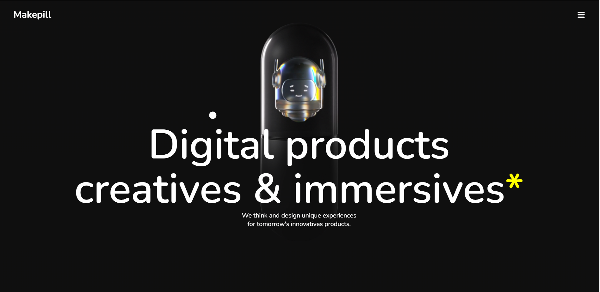

# 💊 MakePill Website UI Clone

A modern, clean, and responsive **UI clone** of the MakePill website built using **HTML, CSS, and JavaScript**. This project focuses on creating a pixel-perfect and interactive frontend experience that closely resembles the original MakePill health-tech design.

## 🔍 Features

- ⚡ Fully responsive layout (mobile, tablet, laptop)
- 🎯 Pixel-perfect UI
- 💻 Built using **HTML5**, **CSS3**, and **Vanilla JavaScript**
- 🌙 Smooth animations and transitions
- 🧩 Modular and clean codebase
- 🧠 No external libraries – pure frontend build

## 📸 Screenshots

> Add your screenshots here if available  
> _Example_:  

## 🛠️ Tech Stack

- HTML5  
- CSS3  
- JavaScript 

## 🚀 Live Demo

[🔗 View Live Demo](https://make-pill-website-ui.vercel.app/)

## 📁 Folder Structure

MakePill-Website-UI/
├── index.html
├── style.css
├── script.js
├── assets/
│ └── images, icons, logos
└── README.md

## 📌 Learning Outcomes

- Deepened understanding of responsive web design
- Enhanced skills in layout structuring and UI/UX design
- Improved animation and interactivity using plain JavaScript

## 🤝 Contributing

Contributions are welcome!  
If you find any issues or want to enhance the design, feel free to submit a pull request.

## 📜 License

This project is for educational and portfolio purposes only. Not intended for commercial use.

---

### Developed with ❤️ by [Gautam Kumar Jha](https://www.linkedin.com/in/gautam-jha-77111634b/)

